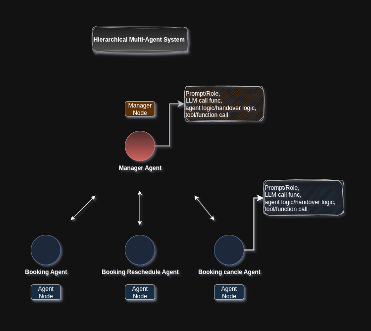

<!-- markdownlint-disable MD030 -->

#  <div style="text-align: left;">  DD (Demystified Designator) </div> 

### A MULTI-AGENT ORCHESTRATION FRAMEWORK 
#### CREATE, DEMYSTIFY AND DESIGNATE AGENTS AT YOUR WILL
#### An Initiative for better INTUTION and INTERPRETATION

#  <div style="text-align: left;">  </div>


[](https://www.linkedin.com/in/faisal-ahmed-siddiqi/)

## 👨 [Visit My Portfolio](https://munnafaisal.github.io/PORTFOLIO-OF-FAISAL-AHMED-SIDDIQI/)

## ✨  DEMO

https://github.com/user-attachments/assets/4ff718b1-4ce6-42e2-853f-1ce036f785e1

## 🚀 This repository is a Multi-agent orchestration framework using [bigtree](https://bigtree.readthedocs.io/stable/gettingstarted/demo/tree/).

#### 📚 Here is a VERY SIMPLIFIED example which implements a hierarchical AI agent structure using bigtree for managing agentnodes. It utilizes Google's Generative AI (genai) models to power the conversational agents.The core functionality revolves around a "manager agent" that triages user requests and hands them over to specialized "service agents" (e.g., booking, rescheduling)

#  <div style="text-align: center;">  </div>

## ⚡️ Quickstart

### How to Install 

- Create a conda env using the ``` environment.yml``` file

```   conda env create -f environment.yml ```
- Visit Google AI studio and create a free API and export your API(Linux system) in a terminal as following

```export GOOGLE_API_KEY = <YOUR API_KEY> ```

- You are recommended to run every command in the same terminal (To have the access of the env variables) to keep the session alive 

### Create multiple agents from scratch and the agents are going to managed by a **Manager Agent**  

## Overview
**Structure** : Hierarchical
```
Two types of Agent:

    1.MANAGER AGENT
    2.SERVICE AGENT(e.g., booking, rescheduling)
```

### How to create node ....!! [Visit the **bigtree** Documentation for details](https://bigtree.readthedocs.io/stable/gettingstarted/demo/tree/)
#### From the Documentation you are recommended to learn 
- making different types of tree.
- parent-child relationship
- Shibling relationship
- How to find Node by name
- Store data in the Node object

**Simplified Examples**
```
from bigtree import Node, print_tree, hprint_tree, vprint_tree

root = Node("a", alias="alias-a", age=90, gender="F")
b = Node("b", age=65, gender="M", parent=root)
c = Node("c", alias="alias-c", age=60, gender="M", parent=root)
d = Node("d", age=40, gender="F", parent=b)
e = Node("e", age=35, gender="M", parent=b)
print_tree(root) 
# a
# ├── b
# │   ├── d
# │   └── e
# └── c

hprint_tree(root) 
#            ┌─ d
#      ┌─ b ─┤
# ─ a ─┤     └─ e
#      └─ c

vprint_tree(root) 
#         ┌───┐
#         │ a │
#         └─┬─┘
#      ┌────┴─────┐
#    ┌─┴─┐      ┌─┴─┐
#    │ b │      │ c │
#    └─┬─┘      └───┘
#   ┌──┴───┐
# ┌─┴─┐  ┌─┴─┐
# │ d │  │ e │
# └───┘  └───┘


```
### How to Run 
 **You just need type the command ``` python3 gradio_UI.py ``` but before execution I recommend you go through the script step by step as following**

**1. Imports**
```
The script begins by importing necessary libraries:
    ● gradio for building the web-based user interface.
    ● bigtree for creating and managing a tree-like structure of agents.
    ● dotenv for loading environment variables (e.g., API keys).
    ● google.genai for interacting with Google's AI models.
    ● pydantic for data validation and defining structured model responses.
    
    ● Custom modules for agent-specific functions and logic:
       
       ○ AGENT_FUNCTIONS.booking_agent_function.get_func_response
       ○ AGENT_FUNCTIONS.reschedule_agent_function.get_reschedule_func_respone
       ○ HAND_OVER_LOGICS.agent_logic.manager_agent_logic
       ○ HAND_OVER_LOGICS.agent_logic.booking_agent_logic
       ○ HAND_OVER_LOGICS.agent_logic.reschedule_agent_logic
```
**2. Google Generative AI Client Initialization**
``` 
 client = genai.Client()
```

This initializes the Google Generative AI client after loading environment variables, presumably
for API authentication.

**3. Pydantic Models for LLM Responses**
Two Pydantic models define the expected structure of responses from the language models
(LLMs):

```
● MANAGER_FUNC: Used by the manager agent to determine the SERVICE_TYPE and AGENT_REPLY.
○ SERVICE_TYPE: String indicating the type of service requested (e.g., "BOOKING", "RESCHEDULE", "CANCEL", "NA") returned by MANAGER AGENT.
○ AGENT_REPLY: String containing the agent's conversational response.
● BOOKING_FUNC: Used by service-specific agents (e.g., booking, rescheduling) to indicate SERVICE_STATUS and AGENT_REPLY.
○ SERVICE_STATUS: String indicating the status of the service operation (e.g., "DONE", "PENDING", "NA") returned by SERVICE AGENTS.
○ AGENT_REPLY: String containing the agent's conversational response.
```

**4. LLM Interaction Functions**

```
    ● get_ANS_FROM_MNG_LLM(my_prompt, my_content, my_query):
       ○ Sends a request to the gemini-2.0-flash model.
       ○ Uses agent_manager_prompt as my_prompt.
       ○ Configures the response to be in application/json format, conforming to the
          MANAGER_FUNC schema.
       ○ Returns the parsed response.
    ● get_ANS_FROM_SERVICE_LLM(my_prompt, my_content, my_query):
       ○ Similar to get_ANS_FROM_MNG_LLM but for service agents.
       ○ Uses booking_agent_prompt or reschedule_agent_prompt as my_prompt.
       ○ Configures the response to conform to the BOOKING_FUNC schema.
       ○ Returns the parsed response.
```

**5. Agent Prompts**

The script defines detailed prompts for each agent, guiding their behavior and response
generation:

```
    ● agent_manager_prompt: Defines the role of the customer service manager, outlining
       how to identify service types (booking, reschedule, cancel, or "NA" for others) and
       respond accordingly.
    ● booking_agent_prompt: Defines the role of the booking agent, specifying responses
       based on the success or failure of a "FUNCTION_CALL" and how to handle
       out-of-scope queries.
    ● reschedule_agent_prompt: Defines the role of the rescheduling agent, similar to the
       booking agent prompt but tailored for rescheduling tasks, including handling
       "FUNCTION_CALL" outcomes and out-of-scope requests.
```

**6. Agent Node Definitions (using bigtree)**

The system's agent hierarchy is defined using bigtree.Node objects:
   
```
● agent_manager: The root node, responsible for initial query routing.

○ role: agent_manager_prompt
○ llm_res: get_ANS_FROM_MNG_LLM
○ agent_logic: manager_agent_logic (determines handover status)
○ func_call: False (manager agent doesn't perform function calls directly)

● booking_agent: Child node of agent_manager, handles appointment booking.
○ role: booking_agent_prompt
○ parent: agent_manager
○ llm_res: get_ANS_FROM_SERVICE_LLM
○ agent_logic: booking_agent_logic
○ func_call: True (implies it can make external function calls for booking)
○ fucn_name: get_func_response (the actual function to call for booking)

● rescheduling_agent: Child node of agent_manager, handles appointment
rescheduling.

○ role: reschedule_agent_prompt
○ parent: agent_manager
○ llm_res: get_ANS_FROM_SERVICE_LLM
○ agent_logic: reschedule_agent_logic
○ func_call: True
○ fucn_name: get_reschedule_func_response (the actual function to call for
rescheduling)

● cancel_agent: Commented out but intended as another service agent for
cancellations.
```

**7. Gradio User Interface**

```
The script sets up a Gradio interface for interaction:
    ● gr.Blocks(): Creates a block-based Gradio application.
    ● gr.Column(): Arranges UI elements vertically.
    ● chatbot = gr.Chatbot(type="messages"): Displays the conversation history.
    ● msg = gr.Textbox(): Input field for the user's message.
    ● clear = gr.ClearButton([msg, chatbot]): Button to clear the input and chat history.
```

**8. respond Function (Chatbot Logic)**
This function defines the core conversational flow:

```
    ● Takes message (user input) and chat_history as arguments.
    ● global current_node: Keeps track of the currently active agent.
    ● Determines content based on whether the current_node (agent) has func_call
       enabled. If so, it calls the agent's associated function (current_node.fucn_name) with
       the user's query and includes the result in the content.
    ● Calls the current agent's LLM (current_node.llm_res) with the appropriate prompt,
       content, and query to get a response (res).
    ● Calls the current agent's agent_logic to determine the state (including handover status
       and potentially service_status or agent_node for handover).

● Handover Logic (if state['handover']:):

○ If a handover is required:
■ It checks for service_status in the state (relevant for service agents).
■ If service_status is "DONE": The conversation is considered resolved by
the previous agent. The current_node switches to the agent specified in
state['agent_node'] (usually back to the manager), and a completion
message is appended to the chat history.

■ If service_status is "NA": The previous agent couldn't handle the query.
The current_node switches to the agent specified in
state['agent_node'], and a message indicating the handover and asking
for re-explanation is appended.

■ If no service_status (typically for the manager agent where service_type is available): The current_node
switches to the agent specified in state['agent_node'], and a general
handover message is appended.

● Continue Conversation (else:):
○ If no handover is required, the conversation continues with the current_node
(agent), and the agent's reply is appended to the chat history.
● Finally, it returns an empty string for the message input and the updated chat_history.

```

**9. Gradio Event Handling**

```
    msg.submit(respond, [msg, chatbot], [msg, chatbot])
```

This line binds the respond function to the submit event of the msg textbox. When the user
presses Enter or submits the message, the respond function is called with the current
message and chatbot history, and the results are used to update the message input and
chatbot display.

**10. Launching the Gradio Demo**

```
    if __name__ == "__main__":
    demo.height = 25
    demo.width = 25
    demo.launch()
```

This block ensures that the Gradio application is launched only when the script is executed
directly. demo.height and demo.width are set, and demo.launch() starts the Gradio web server.

# How it Works (Flow)

1. **User Initiates Conversation** : The user types a message into the Gradio UI.
2. **Manager Agent (Initial State)** : The current_node is initially agent_manager.
3. **Manager Processes Query** : The respond function calls agent_manager.llm_res
    (get_ANS_FROM_MNG_LLM) with the user's query. The manager's LLM determines the
    SERVICE_TYPE (e.g., "BOOKING", "RESCHEDULE", "NA").
4. **Manager Handover Logic** : manager_agent_logic is invoked. Based on the
    SERVICE_TYPE, it decides if a handover is needed and to which specialized agent
    (booking_agent, rescheduling_agent, or back to manager if "NA").
5. **Agent Handover** : If a handover is determined, current_node is updated to the new
    specialized agent (e.g., booking_agent). A handover message is displayed.
6. **Specialized Agent Interaction** : Now, when the user types a new message, the
    current_node (e.g., booking_agent) processes it.
       ○ If the agent has func_call set to True, its associated function
          (get_func_response or get_reschedule_func_response) is called to attempt a
          practical action (like booking an appointment). The result of this function call is
          included in the content sent to the LLM.
       ○ The agent's LLM determines the SERVICE_STATUS ("DONE", "PENDING", "NA")
          and AGENT_REPLY.
7. **Specialized Agent Handover Logic** : The specialized agent's agent_logic (e.g.,
    booking_agent_logic) evaluates the SERVICE_STATUS.
       ○ If "DONE", it signals a handover back to the agent_manager with a success
          message.
       ○ If "PENDING", it continues the conversation with the current specialized agent,
          prompting the user for more information.
       ○ If "NA", it signals a handover back to the agent_manager with an indication that
          the query was out of scope for that specialized agent.
8. **Conversation Continues or Resolves** : This loop continues until a service is "DONE"
    (leading to a return to the manager for further inquiries) or until a query is deemed out
    of scope and handed back to the manager to re-triage or advise contacting customer
    relations.
